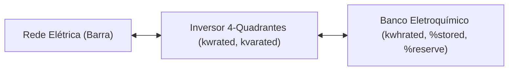
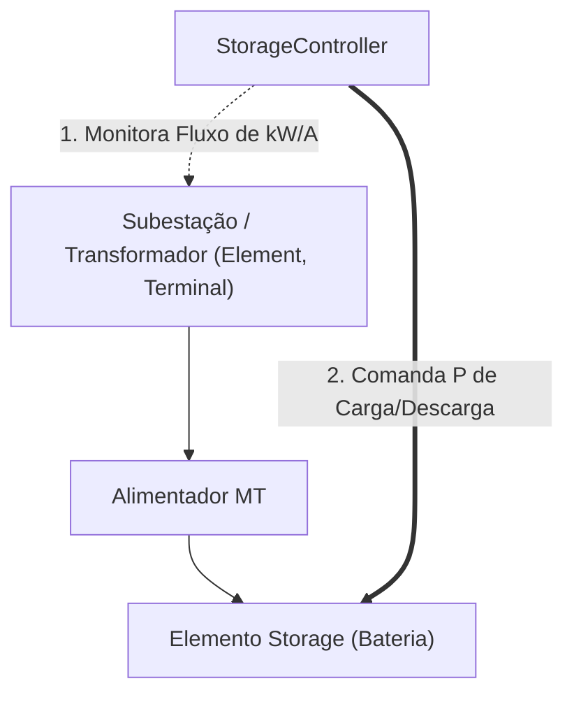

# Guia de Modelagem de BESS no OpenDSS: Storage, StorageController e Dispositivos Associados

Este documento detalha o funcionamento, sintaxe, parâmetros, variáveis internas e modos de controle para sistemas de armazenamento de energia em baterias (**BESS** - *Battery Energy Storage System*) no **OpenDSS**, incluindo os elementos `Storage`, `StorageController` e equipamentos correlatos (`InvControl`, `Monitor`, `EnergyMeter`).

---

## 1. Arquitetura em Camadas do BESS no OpenDSS

No OpenDSS, o armazenamento de energia é modelado em duas camadas funcionais distintas:

1. **Camada de Ativo Físico (`Storage`)**: Representa os componentes físicos: as células de bateria eletroquímica, o inversor bidirecional de 4 quadrantes, eficiências de conversão, limites de potência (kW/kVA) e capacidade de energia (kWh).
2. **Camada de Controle e Automação (`StorageController` e `InvControl`)**: Representa a lógica de controle que monitora as grandezas elétricas da rede (tensão, corrente, potência ativa e reativa em transformadores ou alimentadores) e comanda o ponto de operação das baterias.

---

## 2. O Elemento `Storage` (Bateria Física e Inversor)

Fisicamente, o OpenDSS trata o elemento `Storage` como um gerador/carga conectado à barra através de uma admitância equivalente. Ele pode operar em 4 quadrantes:
* **Injeção de Potência Ativa ($P > 0$)**: Modo de **descarga** (*Discharging*).
* **Absorção de Potência Ativa ($P < 0$)**: Modo de **carga** (*Charging*).
* **Injeção/Absorção de Reativos ($Q$)**: Suporte de potência reativa (indutivo ou capacitivo).



### 2.1 Sintaxe Padrão no OpenDSS

```text
New Storage.BESS1 
~ phases=3 bus1=Barra12.1.2.3 kv=13.8 
~ kwrated=500 kvarated=550
~ kwhrated=2000 kwhstored=1000 %stored=50 %reserve=20
~ %EffCharge=90 %EffDischarge=90 %IdlingkW=0.1
~ dispmode=Follow daily=curva_bess
```

---

### 2.2 Dicionário de Parâmetros do `Storage`

#### A. Conexão Elétrica e Potência Nominal
* `phases`: Número de fases do equipamento (1 para monofásico, 3 para trifásico).
* `bus1`: Barra de conexão à rede e definição de nós (ex.: `Barra12.1.2.3` ou `BarraBixa.1.0`).
* `kv`: Tensão nominal entre fases (kV fase-fase para trifásico ou kV fase-terra para monofásico).
* `kwrated`: Potência ativa máxima contínua do inversor em **kW**. Define o limite físico superior para carga ou descarga.
* `kvarated`: Potência aparente nominal do inversor em **kVA**. Limita o envelope operacional conjunto de $P$ e $Q$ ($S = \sqrt{P^2 + Q^2} \le S_{\text{nom}}$).
* `pf`: Fator de potência nominal da injeção.
* `kvar`: Potência reativa fixa injetada (+) ou absorvida (-) quando não operando em modo de controle automático de tensão.

#### B. Capacidade de Armazenamento e Estado Energético
* `kwhrated`: Capacidade nominal total do banco de baterias em **kWh**.
* `kwhstored`: Energia líquida atualmente armazenada no banco em **kWh**.
* `%stored`: Estado de carga atual (**SOC** - *State of Charge*) expresso em porcentagem ($0\%$ a $100\%$). Representa $\frac{kwhstored}{kwhrated} \times 100$.
* `%reserve`: Reserva energética mínima não descarregável (em %). O OpenDSS impede que a bateria descarregue abaixo desse patamar, preservando a vida útil útil das células (profundidade de descarga limite - *Depth of Discharge*).

#### C. Eficiências e Consumos Parasitas
* `%EffCharge`: Eficiência do ciclo de carga (ex.: `90` indica 90%). Para armazenar 90 kWh na bateria, o sistema absorve 100 kWh da rede; os 10 kWh restantes são dissipados como perdas térmicas.
* `%EffDischarge`: Eficiência do ciclo de descarga (ex.: `90` indica 90%). Para injetar 90 kWh na rede, o banco consome 100 kWh de sua energia química interna.
* `%IdlingkW`: Consumo parasitário em vazio (kW). Potência ativa contínua drenada da rede para manter inversores alimentados, filtros ativos, sistemas de refrigeração e controladores em *standby*, mesmo com $P_{\text{bateria}} = 0$.
* `%Idlingkvar`: Consumo reativo em repouso.

#### D. Estados Internos e Modos de Operação
O OpenDSS possui uma variável interna discreta chamada `State`:
* `IDLING`: Sistema em repouso/espera ($P = 0$, consumindo apenas `%IdlingkW`).
* `CHARGING`: Bateria absorvendo potência ativa da rede para recarga.
* `DISCHARGING`: Bateria injetando potência ativa na rede.

O parâmetro `dispmode` define a origem do comando de despacho:
* `dispmode=Default`: Modo autônomo baseado em disparo horário (`timeChargeTrig`) ou submetido a um elemento `StorageController`.
* `dispmode=Follow`: A bateria replica diretamente os multiplicadores da curva (`daily`, `yearly` ou `duty`) associada. Multiplicadores positivos descarregam; multiplicadores negativos carregam.
* `dispmode=LoadLevel`: O despacho é proporcional ao nível instantâneo de carga do sistema.
* `dispmode=External`: O despacho de $P$ e $Q$ é gerenciado passo a passo externamente (ex.: via Python/COM/DirectDLL a cada iteração).

---

## 3. O Elemento `StorageController` (Controle Centralizado)

O `StorageController` atua como um agente de supervisão central: ele monitora grandezas elétricas em um elemento da rede (transformador de subestação, linha tronco ou alimentador) e calcula dinamicamente a potência de carga ou descarga necessária para atingir um objetivo operacional pré-fixado.



### 3.1 Sintaxe Padrão no OpenDSS

```text
New StorageController.ControleSubestacao
~ Element=Transformer.Substation Terminal=1
~ ElementList=[Storage.BESS1]
~ Mode=PeakShave
~ kWTarget=1200
~ kWTargetLow=400
~ %RateKW=100
~ %RateCharge=50
~ %Reserve=20
```

---

### 3.2 Dicionário de Parâmetros do `StorageController`

#### A. Alvo Monitorado e Ativos Gerenciados
* `Element`: Nome do elemento da rede a ser monitorado (ex.: `Transformer.TrafoSub`, `Line.LinhaTronco`).
* `Terminal`: Terminal do elemento onde a medição é efetuada (`1` para primário/alta, `2` para secundário/baixa).
* `ElementList`: Lista de elementos `Storage` comandados por este controlador (ex.: `[Storage.BESS1, Storage.BESS2]`).
* `Weights`: Vetor de pesos para rateio de esforço entre múltiplas baterias (ex.: `[0.6, 0.4]` distribui 60% do despacho para a primeira e 40% para a segunda).

#### B. Modos de Controle (`Mode`)
* `Mode=PeakShave` (Corte de Pico de Demanda):
  * **Descarga**: Se o fluxo de potência ativa no `Element` exceder `kWTarget`, o controlador comanda as baterias para injetarem a potência exata necessária para limitar o fluxo a `kWTarget`.
  * **Recarga**: Se o fluxo cair abaixo de `kWTargetLow` (horário de baixa demanda ou alta geração solar reversa), o controlador comanda a recarga das baterias até o limite de `kWTargetLow`.
* `Mode=I-PeakShave`: Idêntico ao *PeakShave*, porém o limiar de atuação é baseado na corrente de fase em **Amperes**, ideal para alívio térmico direto de cabos e condutores.
* `Mode=Follow`: Despacha a lista agregada de baterias para seguir uma curva de carga de referência.
* `Mode=Support`: Fornece suporte de potência para estabilização de frequência ou potência de intercâmbio.
* `Mode=Time`: Despacho puramente cronológico baseado em relógio diário.

#### C. Ajustes Finos de Controle
* `kWTarget`: Limiar superior de potência ativa (kW) para disparo de descarga (*Peak Shaving*).
* `kWTargetLow`: Limiar inferior de potência ativa (kW) para disparo de recarga (*Valley Filling* / Absorção de fluxo reverso).
* `%RateKW`: Taxa máxima de descarga permitida (em % da potência nominal `kwrated` da bateria).
* `%RateCharge`: Taxa máxima de recarga permitida (em % de `kwrated`).
* `InhibitTime`: Intervalo de tempo de inibição/carência para evitar chaveamentos espúrios e instabilidades de controle.

---

## 4. Equipamentos e Controles Conectados ao BESS

```mermaid
flowchart LR
    subgraph Controle de Potência Ativa (P)
        SC["StorageController\n(PeakShave / Horário)"] -->|kW Carga/Descarga| BESS["Storage"]
    end
    
    subgraph Controle de Tensão e Reativos (Q)
        IC["InvControl\n(Volt-Var / Volt-Watt)"] -->|kvar / Redução kW| BESS
    end
    
    subgraph Diagnóstico e Medição
        BESS --> Mon["Monitor\n(Mode 1: P, Q | Mode 3: SOC)"]
        Grid["Trafo Subestação"] --> EM["EnergyMeter\n(Perdas totais, Energia Líquida)"]
    end
```

### 4.1 `InvControl` (Controle Avançado de Inversores)
O `StorageController` gerencia a **potência ativa ($P$)**. Já o `InvControl` monitora a **tensão local ($V$)** e comanda a eletrônica do inversor para regulação de tensão:
* **Função Volt-Var**: Se a tensão na barra subir devido a excedentes de geração solar, o inversor do BESS absorve reativos ($Q < 0$) para reduzir a amplitude de tensão local sem interferir no estado químico da bateria.
* **Função Volt-Watt**: Se a tensão ultrapassar o limiar crítico normativo (ex.: 1.05 p.u.) e a absorção de reativos estiver saturada, o inversor modula a potência ativa para mitigar sobretensões severas.

### 4.2 `Monitor`
Dispositivo virtual de aquisição de dados anexado ao terminal do BESS para registrar os perfis temporais:
* `mode=1`: Grava as potências complexas por fase ($P_1, P_2, P_3, Q_1, Q_2, Q_3$).
* `mode=3`: Grava as variáveis de estado do `Storage` (`State`, `%stored` / SOC, perdas internas em kWh).

```text
New Monitor.Mon_BESS element=Storage.BESS1 terminal=1 mode=3
```

### 4.3 `EnergyMeter`
Instalado no primário ou secundário do transformador da subestação. Ele integra perdas no alimentador ($I^2 R$), fluxo reverso acumulado em kWh e pico de demanda registrado no ciclo de 24 horas, permitindo a comparação direta de desempenho entre o alimentador sem BESS e com BESS.

---

## 5. Comparativo: Controle por Curva Estática vs. `StorageController`

| Critério | Controle Manual via `LoadShape` (`dispMode=Follow`) | Controle Automático via `StorageController` |
| :--- | :--- | :--- |
| **Princípio Operacional** | Multiplicadores horários rígidos e estáticos. | Malha de realimentação com medição do fluxo em tempo real. |
| **Adaptabilidade** | Nula. A bateria carrega e descarrega no horário fixado, haja ou não excedente solar. | Total. Só carrega se houver fluxo reverso/baixa demanda e só descarrega se houver sobrecarga. |
| **Estabilidade Numérica** | Sujeito a singularidades e travamentos na matriz de admitâncias quando ocorrem reversões abruptas simultâneas de fluxo. | Total convergência assegurada pelo laço de controle iterativo de Newton-Raphson do OpenDSS. |
| **Fidelidade Real** | Abordagem simplificada de laboratório. | Modela com exatidão a automação real de concessionárias e microredes modernas. |
